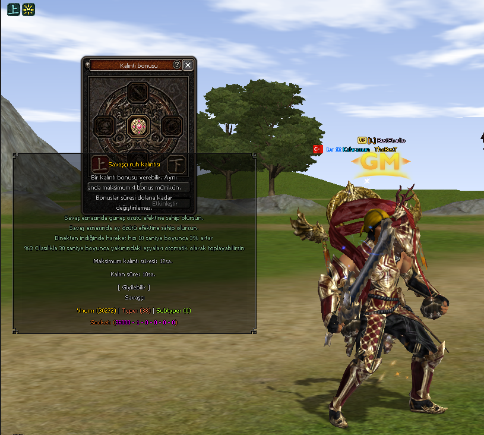

# Official Passive Attr System

## Resmi Kalıntı Sistemi



Tanıtım videosu: [YouTube üzerinde izle](https://youtu.be/7tvxfQOEupU)

Bu paket, Metin2 için hazırlanmış **Resmi Kalıntı Sistemi** exportudur. Sistem `__PASSIVE_ATTR__` ve `ENABLE_PASSIVE_ATTR` define yapısı üzerinden ayrıştırılmıştır.

Pasif Kalıntı sistemi; karakterin sınıfına uygun ruh kalıntısını kuşanması, materyal ve kalıntı parçalarıyla bonus üretmesi, üretilen pasif özellikleri süreli olarak etkinleştirmesi ve savaş içinde server otoritesiyle çalışan özel pasif bonuslar kazanması üzerine kuruludur.

Bu export sadece Python UI değildir. Client source, server game, db boot akışı, common packet/slot yapıları, DumpProto parser, pack assetleri, locale/proto satırları ve SQL dosyaları birlikte çalışır.

## Klasör Yapısı

```txt
Official Passive Attr System
├─ 01. Svn
│  ├─ Client
│  │  ├─ GameLib
│  │  └─ UserInterface
│  ├─ Server
│  │  ├─ common
│  │  ├─ db
│  │  └─ game
│  └─ Tools
│     └─ dump_proto
├─ 02. Client
│  ├─ d
│  │  └─ ymir work
│  ├─ icon
│  ├─ locale
│  │  └─ locale
│  │     ├─ common
│  │     └─ tr
│  ├─ root
│  └─ uiscript
├─ 03. Server
│  └─ mysql
│     └─ player
├─ Added
│  ├─ 01. Svn
│  ├─ 02. Client
│  └─ 03. Server
├─ official-passive-attr-system.png
└─ README.md
```

Paket şu anki güncel haliyle `281` dosyadan oluşuyor.

## Sistem Mimarisi

Server tarafındaki ana sınıf:

```txt
CPassiveAttrManager
```

Bu manager pasif kalıntı tablosunu yükler, kalıntı iteminin bonus üretme/şarj/aktif etme akışını yönetir, oyuncu üzerindeki pasif özellikleri uygular ve savaş sırasında tetiklenen özel bonusları kontrol eder.

Client source tarafındaki ana parçalar:

```txt
CPythonPassiveAttr
PythonNetworkStream
PythonPlayerModule
PythonItemModule
PythonApplicationModule
```

Bu parçalar Python UI ile client binary arasındaki köprüyü kurar. `net.SendPassiveAttr*`, `passiveattr` modülü, player sabitleri, item tipi/subtype bilgileri ve packet alım-gönderim akışı bu katmanda bulunur.

Pack tarafındaki ana pencere:

```txt
02. Client/root/uipassiveattr.py
02. Client/uiscript/passiveattr.py
```

Bu pencere kalıntı slotlarını, materyal slotlarını, bonus sayfalarını, şarj/aktif etme akışını, tooltipleri ve client tarafındaki görsel kontrolü yönetir.

## Define Bilgisi

Server:

```cpp
#define __PASSIVE_ATTR__
```

Client:

```cpp
#define ENABLE_PASSIVE_ATTR

#if defined(ENABLE_PASSIVE_ATTR)
	#define ENABLE_PASSIVE_ATTR_TOOLTIP
#endif
```

`ENABLE_PASSIVE_ATTR_TOOLTIP` ana sistem için zorunlu değildir; tooltip ve yardım açıklamalarını açar. Ana sistem için packet, item window, DB, proto, manager ve UI parçaları birlikte entegre edilmelidir.

## Bağlı Parçalar

Bu sistemin tam çalışması için aşağıdaki parçalar birlikte bulunmalıdır:

```txt
Packet sistemi        -> HEADER_CG_PASSIVE_ATTR / HEADER_GC_PASSIVE_ATTR
Item window sistemi   -> WEAR_PASSIVE, WEAR_PASSIVE_ATTR_UP, WEAR_PASSIVE_ATTR_DOWN
Item proto sistemi    -> ITEM_PASSIVE, PASSIVE_JOB ve pasif kalıntı subtype bilgileri
DB boot sistemi       -> passive_attr tablosunun DB serverdan game servera gönderilmesi
Server manager        -> passive_attr.cpp / passive_attr.h
Affect sistemi        -> AFFECT_PASSIVE_JOB_DECK
Battle hookları       -> saldırı, ölüm, boss/metin, mount/dismount ve özel proc kontrolleri
Client bindingleri    -> net, player, item, passiveattr ve app tarafındaki fonksiyonlar
Pack UI               -> uipassiveattr.py, passiveattr.py, character/keychange bağlantıları
Locale/proto          -> kalıntı itemleri, kalıntı parçaları, açıklamalar ve skill metinleri
DumpProto parser      -> ITEM_PASSIVE / PASSIVE_JOB proto çevirimi
```

Kod içinde görülebilen ama ana sistem için doğrudan zorunlu olmayan uyumluluk define'ları:

```txt
ENABLE_PASSIVE_ATTR_TOOLTIP -> Tooltip/yardım metni tarafını açar.
ENABLE_DS_GRADE_MYTH        -> Tooltip tarafında Dragon Soul metin düzeniyle aynı bloklarda görülebilir.
ENABLE_PROTO_RENEWAL        -> Proto okuma/parse akışı farklı olan forklar için kontrol edilmelidir.
```

## 01. Svn

`01. Svn` klasörü source entegrasyonu içindir.

### Client Source

```txt
01. Svn/Client/GameLib/ItemData.h
01. Svn/Client/UserInterface/GameType.cpp
01. Svn/Client/UserInterface/GameType.h
01. Svn/Client/UserInterface/InstanceBase.h
01. Svn/Client/UserInterface/Locale_inc.h
01. Svn/Client/UserInterface/Packet.h
01. Svn/Client/UserInterface/PythonApplication.h
01. Svn/Client/UserInterface/PythonApplicationModule.cpp
01. Svn/Client/UserInterface/PythonCharacterManagerModule.cpp
01. Svn/Client/UserInterface/PythonCharacterModule.cpp
01. Svn/Client/UserInterface/PythonItemModule.cpp
01. Svn/Client/UserInterface/PythonNetworkStream.cpp
01. Svn/Client/UserInterface/PythonNetworkStream.h
01. Svn/Client/UserInterface/PythonNetworkStreamModule.cpp
01. Svn/Client/UserInterface/PythonNetworkStreamPhaseGame.cpp
01. Svn/Client/UserInterface/PythonNetworkStreamPhaseGameItem.cpp
01. Svn/Client/UserInterface/PythonPassiveAttr.cpp
01. Svn/Client/UserInterface/PythonPassiveAttr.h
01. Svn/Client/UserInterface/PythonPlayer.cpp
01. Svn/Client/UserInterface/PythonPlayerModule.cpp
01. Svn/Client/UserInterface/StdAfx.h
01. Svn/Client/UserInterface/UserInterface.cpp
01. Svn/Client/UserInterface/UserInterfaceProject.md
```

`PythonPassiveAttr.cpp` ve `PythonPassiveAttr.h` yeni dosyalardır. Visual Studio kullanan source'larda bu dosyalar `UserInterface` projesine eklenmelidir. Gerekli proje notları `UserInterfaceProject.md` içinde bulunur.

### Server Source

```txt
01. Svn/Server/common/item_length.h
01. Svn/Server/common/length.h
01. Svn/Server/common/service.h
01. Svn/Server/common/tables.h
01. Svn/Server/common/VnumHelper.h
01. Svn/Server/db/ClientManager.cpp
01. Svn/Server/db/ClientManager.h
01. Svn/Server/db/ClientManagerBoot.cpp
01. Svn/Server/db/ClientManagerPlayer.cpp
01. Svn/Server/db/ProtoReader.cpp
01. Svn/Server/game/affect.h
01. Svn/Server/game/char_battle.cpp
01. Svn/Server/game/char_horse.cpp
01. Svn/Server/game/char_item.cpp
01. Svn/Server/game/input_db.cpp
01. Svn/Server/game/input_main.cpp
01. Svn/Server/game/input.h
01. Svn/Server/game/item.cpp
01. Svn/Server/game/item_manager.cpp
01. Svn/Server/game/main.cpp
01. Svn/Server/game/packet.h
01. Svn/Server/game/packet_info.cpp
01. Svn/Server/game/passive_attr.cpp
01. Svn/Server/game/passive_attr.h
01. Svn/Server/game/Makefile.md
```

`passive_attr.cpp` ve `passive_attr.h` yeni server game dosyalarıdır. FreeBSD/Makefile kullanan yapılarda `passive_attr.cpp` build listesine eklenmelidir. Windows proje kullanan yapılarda ilgili `.vcxproj` içine dahil edilmelidir.

### DumpProto

```txt
01. Svn/Tools/dump_proto/ItemCSVReader.cpp
01. Svn/Tools/dump_proto/ItemCSVReader.h
```

Bu sistem `ITEM_PASSIVE` ve `PASSIVE_JOB` kullandığı için DumpProto tarafı da güncellenmelidir. Aksi halde server/client proto üretirken kalıntı itemleri doğru tipe çevrilemez.

`ItemCSVReader.cpp` içinde bulunması gereken kritik kayıtlar:

```txt
ITEM_PASSIVE
PASSIVE_JOB
arSub38
```

Bu kayıtlar eklendikten sonra DumpProto yeniden derlenmeli ve `item_proto` çıktıları tekrar üretilmelidir.

## 02. Client

`02. Client` klasörü pack tarafı için hazırlanmıştır.

### Root ve UI Script

```txt
02. Client/root/game.py
02. Client/root/interfacemodule.py
02. Client/root/ui.py
02. Client/root/uiaffectshower.py
02. Client/root/uicharacter.py
02. Client/root/uiinventory.py
02. Client/root/uipassiveattr.py
02. Client/root/uitooltip.py
02. Client/uiscript/characterwindow.py
02. Client/uiscript/keychange_window.py
02. Client/uiscript/passiveattr.py
```

`uipassiveattr.py` sistemin ana penceresidir. `interfacemodule.py`, `game.py`, `uicharacter.py` ve `keychange_window.py` tarafındaki bağlantılar pencerenin açılması, tuş ataması ve karakter penceresiyle ilişkisi için gereklidir.

### Görseller, Efektler ve İkonlar

```txt
02. Client/d/ymir work/effect/etc/buff
02. Client/d/ymir work/ui/game/passive_attr
02. Client/d/ymir work/ui/game/windows
02. Client/d/ymir work/ui/skill/common/affect
02. Client/d/ymir work/ui/skill/passive
02. Client/icon/icon/item
```

Bu klasörlerde pasif kalıntı penceresi, skill ikonları, affect ikonları, item ikonları ve buff efektleri bulunur. Pack yapın farklıysa bu içerikler kendi `d`, `icon` ve ilgili UI packlerine göre taşınmalıdır.

### Locale ve Proto

```txt
02. Client/locale/locale/common/item_list.txt
02. Client/locale/locale/common/ui/windows/label_skill_passive.sub
02. Client/locale/locale/tr/item_names.txt
02. Client/locale/locale/tr/item_proto.txt
02. Client/locale/locale/tr/itemdesc.txt
02. Client/locale/locale/tr/locale_game.txt
02. Client/locale/locale/tr/locale_interface.txt
02. Client/locale/locale/tr/ui/windows/label_skill_passive.sub
```

Bu dosyalar mevcut locale dosyalarının üzerine kör şekilde yazılmamalıdır. Hedef clientta aynı dosyalar zaten varsa ilgili satırlar birleştirilmelidir.

## 03. Server

`03. Server` klasörü MySQL tarafı için hazırlanmıştır.

```txt
03. Server/mysql/player/item_passive_attr.sql
03. Server/mysql/player/passive_attr.sql
```

`passive_attr.sql`, sistemin bonus havuzunu ve kalıntı bonus verilerini içerir. DB server boot sırasında bu tablo okunur ve game servera `TPassiveAttrTable` akışıyla gönderilir.

`item_passive_attr.sql`, kalıntı itemleri ve kalıntı parçaları için örnek item kayıtlarını içerir. Mevcut `player.item_proto` veya proto üretim yapın farklıysa bu dosyadaki satırlar direkt ezmek yerine mevcut tablo/proto yapısına göre birleştirilmelidir.

Canlı sunucuda SQL uygulamadan önce tablo yedeği alınmalıdır. Özellikle `DROP TABLE`, `REPLACE`, `INSERT` veya mevcut item vnumlarını etkileyen satırlar kontrol edilmelidir.

## Added Klasörü

`Added` klasörü, sistemi daha kolay kurmak için hazırlanmış hazır eklenmiş örnek dosyaları içerir.

```txt
Added/01. Svn      -> Source tarafında hazır entegre edilmiş örnek dosyalar
Added/02. Client   -> Client pack tarafında hazır eklenmiş örnek dosyalar
Added/03. Server   -> MySQL tarafında hazır eklenmiş örnek dosyalar
```

Bu klasör özellikle karşılaştırma yapmak için kullanışlıdır. Kendi source yapın birebir aynı değilse dosyaları doğrudan ezmeden önce farkları kontrol etmek gerekir. Ana klasördeki `01. Svn`, `02. Client`, `03. Server` dosyaları ise sistemin ayrıştırılmış entegrasyon parçalarıdır.

## Packet Bilgisi

Client -> Game:

```txt
HEADER_CG_PASSIVE_ATTR = 184
TPacketCGPassiveAttr
```

Game -> Client:

```txt
HEADER_GC_PASSIVE_ATTR = 188
TPacketGCPassiveAttr
```

Kullanılan subheader akışı:

```txt
OPEN
CLOSE
CHANGE_PAGE
ADD
CHARGE
ACTIVATE_DEACTIVATE
USE_ITEM_JOB
```

Bu packet header değerleri hedef source üzerinde doluysa çakışma çözülmeden sistem eklenmemelidir.

## Ana Itemler

Kalıntı itemleri:

```txt
30272 -> Warrior Soul Relic / Savaşçı Ruh Kalıntısı
30273 -> Ninja Soul Relic / Ninja Ruh Kalıntısı
30274 -> Sura Soul Relic / Sura Ruh Kalıntısı
30275 -> Shaman Soul Relic / Şaman Ruh Kalıntısı
30276 -> Lycan Soul Relic / Lycan Ruh Kalıntısı
```

Kalıntı parça itemleri:

```txt
30280 -> Warrior Relic Shard / Savaşçı Kalıntı Parçası
30281 -> Ninja Relic Shard / Ninja Kalıntı Parçası
30282 -> Sura Relic Shard / Sura Kalıntı Parçası
30283 -> Shaman Relic Shard / Şaman Kalıntı Parçası
30284 -> Lycan Relic Shard / Lycan Kalıntı Parçası
```

Bu vnumlar hedef serverda kullanılıyorsa sistem eklenmeden önce vnum çakışması çözülmelidir.

## Kurulum Özeti

1. Server `service.h` içine `__PASSIVE_ATTR__` define'ını ekle.
2. Client `Locale_inc.h` içine `ENABLE_PASSIVE_ATTR` define'ını ekle.
3. `01. Svn/Server/common` altındaki item window, packet table ve tablo yapılarını hedef source'a entegre et.
4. `01. Svn/Server/db` altındaki `passive_attr` boot ve proto okuma bağlantılarını ekle.
5. `01. Svn/Server/game/passive_attr.cpp` ve `passive_attr.h` dosyalarını game source'a ekle.
6. Game build listesine `passive_attr.cpp` dosyasını ekle.
7. Server game tarafındaki `char_item`, `char_battle`, `char_horse`, `input_main`, `input_db`, `item`, `item_manager`, `packet_info`, `main` bağlantılarını uygula.
8. Client source tarafında `PythonPassiveAttr.cpp` ve `PythonPassiveAttr.h` dosyalarını `UserInterface` projesine ekle.
9. Client packet, binding, item type, player constant ve application module bağlantılarını uygula.
10. `01. Svn/Tools/dump_proto` içindeki DumpProto parser değişikliklerini ekle.
11. DumpProto'yu yeniden derle ve `item_proto` çıktılarını tekrar üret.
12. `02. Client` içeriğini pack yapına göre ilgili `root`, `uiscript`, `locale`, `d` ve `icon` packlerine ekle.
13. `03. Server/mysql/player/passive_attr.sql` dosyasını DB tarafında uygula.
14. `03. Server/mysql/player/item_passive_attr.sql` içindeki item kayıtlarını mevcut proto/item tablonla birleştir.
15. Client binary, game server, db server ve packleri rebuild et.

## Test Akışı

```txt
1. Client açılırken app.ENABLE_PASSIVE_ATTR 1 dönmeli.
2. passiveattr modülü import edilmeli, uipassiveattr.py hata vermemeli.
3. Kalıntı penceresi karakter penceresi/keychange bağlantısından açılmalı.
4. 30272-30276 itemleri doğru isim, icon ve ITEM_PASSIVE/PASSIVE_JOB tipiyle görünmeli.
5. 30280-30284 kalıntı parçaları doğru isim, icon ve stack davranışıyla görünmeli.
6. Kalıntı itemi doğru wear/window slotuna takılmalı.
7. ADD akışında materyal slotları serverda doğrulanmalı.
8. CHARGE akışında doğru item tüketilmeli ve süre artmalı.
9. ACTIVATE_DEACTIVATE sonrası kalan süre azalmalı ve relog sonrası korunmalı.
10. CHANGE_PAGE ile farklı pasif sayfaları doğru açılmalı.
11. Boss/metin saldırısı, ölümden kurtarma, mount/dismount ve savaş proc bonusları denenmeli.
12. Hatalı packet testi: yanlış page, geçersiz item pos, farklı owner item, boş kalıntı, dolu bonus, cooldown sırasında istek.
```

## Dikkat Edilecek Noktalar

- Packet header değerleri kendi source packet tablonla çakışmamalı.
- `ITEM_PASSIVE` ve `PASSIVE_JOB` hem client/server proto tarafında hem de DumpProto tarafında tanımlı olmalı.
- `passive_attr` tablosu eksikse sistem açılır ama bonus verisi boş geleceği için işlevsiz kalır.
- `passive_attr.cpp` build listesine eklenmezse link aşamasında unresolved external hatası alınır.
- `PythonPassiveAttr` client projesine eklenmezse Python tarafındaki `passiveattr` çağrıları çalışmaz.
- Locale ve item proto satırları komple dosya ezerek değil, mevcut yapıyla birleştirilerek uygulanmalı.
- Canlı SQL uygulamadan önce `player` database yedeği alınmalı.
- Added klasörü referanstır; farklı fork yapılarında doğrudan üstüne yazmak yerine diff alınmalıdır.

## İletişim

Hazırlayan marka: **Best Studio**

- GitHub: [github.com/ybeststudio](https://github.com/ybeststudio)
- Discord Server: [discord.gg/NXmc6JrwYr](https://discord.gg/NXmc6JrwYr)
- Discord ID: `beststudio`
- Web: [bestpro.dev](https://bestpro.dev)
- TurkMMO Forum: [Best Studio](https://forum.turkmmo.com/uye/2104546-best-studio/)
- YouTube: [@ybeststudio](https://www.youtube.com/@beststudiostr)
- Instagram: [@ybeststudio](https://www.instagram.com/ybeststudio)
- Facebook: [ybeststudio](https://www.facebook.com/ybeststudio/)
- Twitter: [@ybeststudio](https://twitter.com/ybeststudio)
- TikTok: [@ybeststudio](https://tiktok.com/@ybeststudio)
